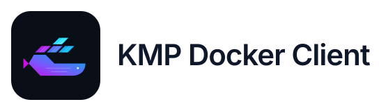

<p align="center">
  
</p>

[](https://central.sonatype.com/artifact/dev.limebeck.libs/docker-client)
[](https://kotlinlang.org)
[](https://ktor.io)

A Kotlin Multiplatform Docker API client for managing a single Docker host, with coroutines, typed models and streaming operations.

**[User guide and API reference (Dokka)](https://limebeck.github.io/kmp-docker-client/)** · [Guide source](docs/USAGE.md) · [Compatibility](docs/COMPATIBILITY.md) · [Migration](docs/MIGRATION-1.0.0.md)

## Installation

`1.3.0` adds all Swarm API 1.51 operations through `client.swarm`, including cluster management, services, tasks and logs. It also includes start/stop/restart controls for existing Compose containers. See the [Swarm guide](docs/SWARM.md) and [Compose guide](docs/COMPOSE.md).

For a JVM project, add:

```kotlin
repositories { mavenCentral() }
dependencies {
    implementation("dev.limebeck.libs:docker-client:1.3.0")
    implementation("org.jetbrains.kotlinx:kotlinx-coroutines-core:1.11.0")
    implementation("io.ktor:ktor-client-core:3.5.2")
}
```

For a Multiplatform project, put these dependencies in `commonMain.dependencies`. The validated runtime targets are **JVM 17+, Node.js and Linux X64 Native on Linux**. Use Kotlin 2.4.20; align explicit Ktor dependencies with 3.5.2. The client accesses a Unix socket and uses fixed Docker API **1.51**. See the compatibility matrix for tested daemon/runtime versions. TCP/TLS, browser JS and Windows named pipes are not implemented; macOS/Windows JVM and Native support is a future milestone.

## Quick start

`DockerClient.use` is available since 1.0.1. With 1.0.0/1.0.0-rc, use `try/finally` and `docker.client.close()` instead.

Run this suspending function from your application's coroutine scope. A JVM CLI can call it inside `runBlocking`.

```kotlin
import dev.limebeck.libs.docker.client.DockerClient
import dev.limebeck.libs.docker.client.api.containers
import dev.limebeck.libs.docker.client.api.system

suspend fun listContainers() {
    DockerClient().use { docker -> // /var/run/docker.sock
        docker.system.ping().getOrThrow()
        docker.containers.getList().getOrThrow().forEach { println(it.names) }
    }
}
```

For a long-running application, reuse a client and close it at shutdown after its collectors and sessions have stopped. The process must have permission to access the Docker socket. Configure a different path explicitly; the SDK does not read Docker contexts or `DOCKER_HOST`.

The [user guide](docs/USAGE.md) covers:

- installation, connection configuration and client ownership;
- Results, HTTP errors, transport exceptions and cancellation;
- pulling images and creating/starting containers;
- volumes, networks, published ports, recreation and retained data;
- logs, stats, events and application-owned recovery;
- interactive exec/attach, binary output, input and TTY resize;
- registry authentication, typed push/load progress and troubleshooting.

Detailed guides: [container lifecycle](docs/CONTAINER-LIFECYCLE.md), [image progress](docs/IMAGE-PROGRESS.md), [stream recovery](docs/STREAM-RECOVERY.md).

The [Compose API in 1.3.0](docs/COMPOSE.md), included in `lib`, provides discovery, logs and start/stop/restart controls for existing Compose projects on JVM, NodeJS and Linux X64, using the same Docker client and endpoint.

## API scope

The SDK implements container, image, volume, network, exec and system operations. Models are generated from Docker's OpenAPI 1.51 schema. Swarm cluster management, nodes, services, tasks, secrets and configs are available through `client.swarm`; see the [Swarm guide](docs/SWARM.md). Complete Docker API coverage is not claimed: plugins remain outside the implemented scope. Compose orchestration, user authentication, roles and audit belong to the application.

Image callbacks report progress; only the final Result establishes the operation outcome within the documented transport limitations. Live streams open on collection and close on cancellation/completion. The SDK never reconnects or replays commands implicitly. Use `incomingChunks` for terminal output and incremental UTF-8 decoding. Read the guide before adding retries or container replacement.

## Examples

- `sample/terminalApp`: native terminal example.
- `sample/htmxDashboard`: [Ktor/HTMX dashboard example](docs/DASHBOARD.md), bound to loopback. Its UI acceptance is independent of SDK releases.

```sh
./gradlew :sample:terminalApp:runDebugExecutableLinuxX64
./gradlew :sample:htmxDashboard:runDebugExecutableLinuxX64
```

## Development and documentation

Use JDK 21 for development. The repository's default version is `1.3.0`; this setting does not publish artifacts. Versions live in `gradle/libs.versions.toml`. After changing Kotlin/JS dependencies, run `./gradlew kotlinUpgradeYarnLock` and commit the lockfile.

```sh
# Requires a development Docker daemon at /var/run/docker.sock.
./gradlew build :lib:checkKotlinAbi --warning-mode=fail --max-workers=2

# HTTP transport regression tests use their own mock socket, not Docker.
./gradlew :lib:jvmTest --tests '*DockerHttpRegressionTest'

# Compile the guide examples and generate the guide + API reference; no Docker required.
./gradlew :lib:dokkaGenerateHtml --warning-mode=fail
```

Documentation output is `lib/build/dokka/html`. `docs/USAGE.md` is included as the Dokka module guide. Blocks marked `compile-sample` are extracted into generated `commonTest` sources, so all target test compilations check them; Dokka also depends on JVM sample compilation. They are compiled, not run as tests or as Docker operations. GitHub Pages publishes the generated documentation on pushes to `master`.

SDK integration tests may pull images and create temporary Docker resources. The separate `daemonRestartTest` runs only through `scripts/with-isolated-docker.sh`, which owns a disposable daemon; it never restarts the user's daemon. PR CI checks Docker 28.5.2/29.0.0 × JDK 17/21, ABI and warnings. Dashboard acceptance is not a release gate.

Release tags `v<semver>` supply the Maven version and trigger the publication workflow. See [stable release checklist](docs/RELEASE-1.0.0.md), [RC evidence](docs/RC-ACCEPTANCE.md) and [project contracts](specs/ipc/README.md).

## License

[MIT](LICENSE).
